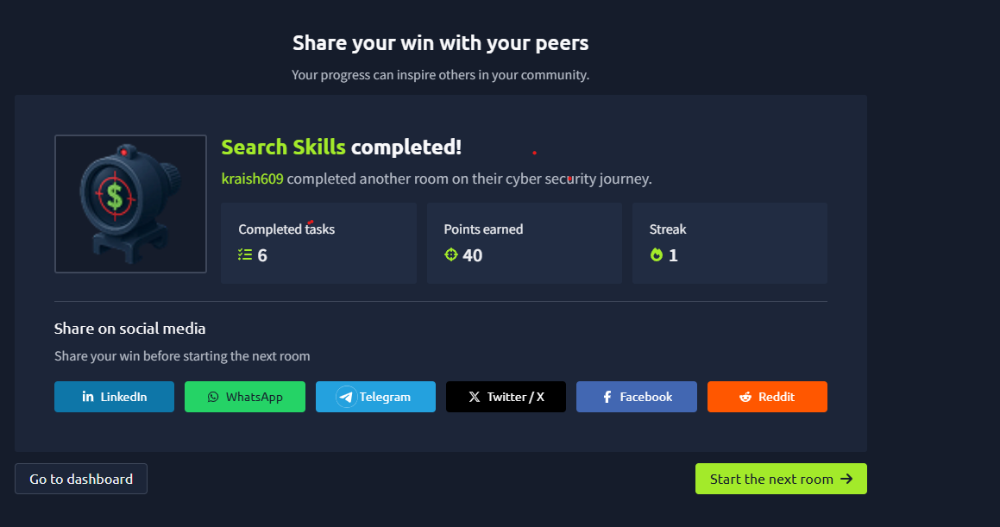

# Day 02 — Search Skills (TryHackMe)

**Date:** 2026-09-20
**Status:** ✅ Completed (6 tasks, 40 pts)

## Tools Learned
- **VirusTotal** — aggregates 70+ AV engines & website scanners. Submit file, URL, domain, or hash for a consensus verdict.

## Key Takeaways
- VirusTotal = consensus, not a final verdict. False positives & negatives happen.
- Attackers can test malware against VirusTotal before releasing it — don't trust a clean result blindly.
- Use it for: quick triage + threat intel on new/suspicious files and links.

## Screenshot

