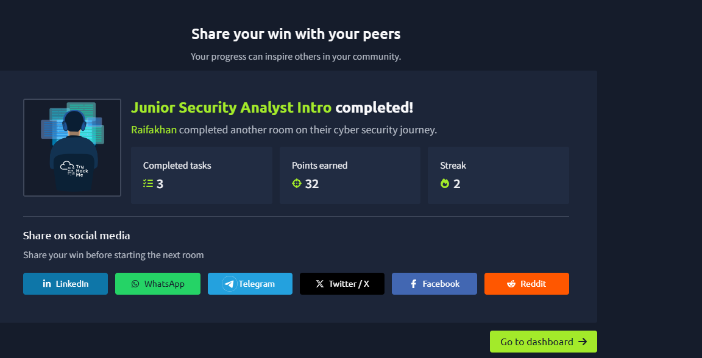

# Day 03 — Junior Security Analyst Intro (TryHackMe)

**Date:** 2026-09-21
**Status:** ✅ Completed (3 tasks, 32 pts)
**Type:** SOC / Blue Team role overview

## Key Takeaways
- Junior Security Analyst = **SOC Level 1 Analyst** — first line of defense in a 24/7 SOC team
- Daily duties: monitor & investigate alerts, attend SOC brainstorms, cooperate with other teams, keep learning new attacks
- Work arrives as **tickets** (alerts/tasks) — you triage them in a timely manner
- SOC is a team, not a solo job. Roles:
  - **Will Griffin** — Senior Analyst (escalation point, handles complex cases)
  - **Corey Stevens** — SOC Engineer (maintains tools, configures alerts)
  - **Emily Conway** — SOC Manager (reports to management, keeps team on track)
  - **Daniel Herrera** — Incident Responder (called for major incidents)
- Career progression: Tier 1 (you) → Senior Analyst → Engineer → Manager/IR

## Lab Activity (Alert Triage)
- Reviewed alerts on a mock SOC dashboard
- **Malicious IP identified:** `221.181.185.159`
- **Escalated to:** Will Griffin (Senior Analyst)
- **Outcome message after firewall block:** `THM{until-we-meet-again}`

## Real-World Context
- Room used **September 2025 cyber news** as examples:
  - Cloudflare blocked a record 11.5 Tbps DDoS
  - Russian APT28 deployed "NotDoor" Outlook backdoor against NATO
  - GitHub account compromise → Salesloft Drift breach affecting 22 companies
  - 20 npm packages with 2 billion weekly downloads compromised (supply chain)
- Point: the news you read about is the job you'll be doing

## Screenshot

