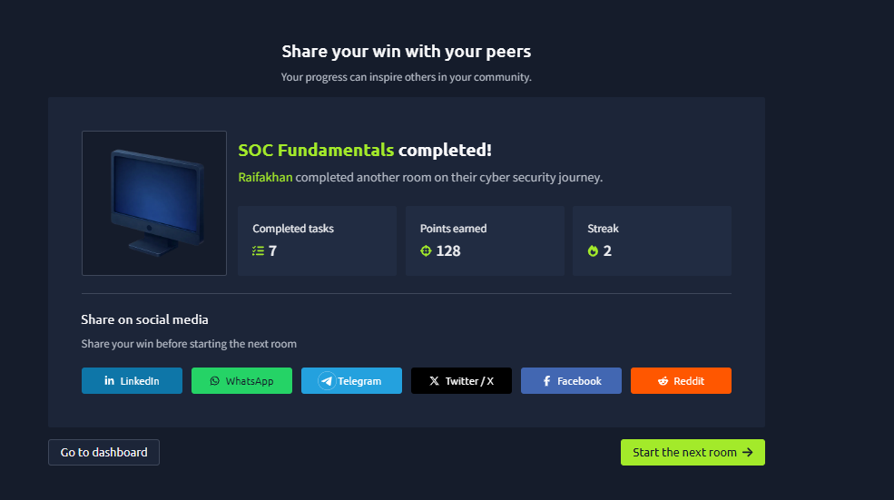

# Day 03 — SOC Fundamentals (TryHackMe)

**Date:** 2026-09-21
**Status:** ✅ Completed (7 tasks, 128 pts)
**Streak:** 2 days
**Type:** SOC / Blue Team core concepts

## What is a SOC?
- **Security Operations Center** — dedicated facility + team that continuously monitors an org's network & resources
- Works **24/7/365** to identify suspicious activity before damage occurs
- Main focus: **Detection** and **Response**

## Detection
- **Detect vulnerabilities** — weaknesses attackers can exploit (unpatched software, etc.)
- **Detect unauthorized activity** — e.g. stolen credentials used to log in
- **Detect policy violations** — breaking company rules (piracy, data leaks)
- **Detect intrusions** — unauthorized access to systems/networks

## Response
- **Support incident response** — minimize impact, find root cause, help IR team

## The 3 Pillars of SOC
**People · Process · Technology**

## SOC Team Roles
- **SOC Analyst (Level 1)** — first responder; triage alerts, escalate
- **SOC Analyst (Level 2)** — deeper investigation, correlates data
- **SOC Analyst (Level 3)** — proactive threat hunting, incident response
- **Security Engineer** — deploys & configures security tools
- **Detection Engineer** — writes detection rules (logic behind alerts)
- **SOC Manager** — manages team, reports to CISO

## Alert Triage — The 5 Ws
Every alert must answer:
- **What** happened?
- **When** did it happen?
- **Where** did it happen?
- **Who** was involved?
- **Why** did it happen?

## Reporting
- Alerts escalated as **tickets** with all 5 Ws + analysis + screenshots as evidence
- Critical detections → trigger **Incident Response** & sometimes **Forensics** (root cause analysis)

## Technology (Security Solutions)
- **SIEM** — collects logs, applies detection rules, correlates, alerts. *Detection only.* Modern ones add UEBA + threat intel + ML
- **EDR** — endpoint-level, real-time + historical visibility, automated response
- **Firewall** — network barrier; monitors incoming/outgoing traffic, filters unauthorized traffic
- Also know: Antivirus, EPP, IDS/IPS, XDR, SOAR
- Choice of tech depends on **threat surface** + **available resources**

## Lab — Level 1 Analyst Practice
- Scenario: port scanning activity detected on host in network
- **What:** Port Scan
- **When:** June 12, 2024 17:24
- **Where:** Destination host `10.0.0.3` (source `10.0.0.8`)
- **Who:** Source hostname `Nessus`
- **Why:** Intended (vuln assessment team had authorized it)
- **Response sent back to port scanner?** No

## Screenshot

