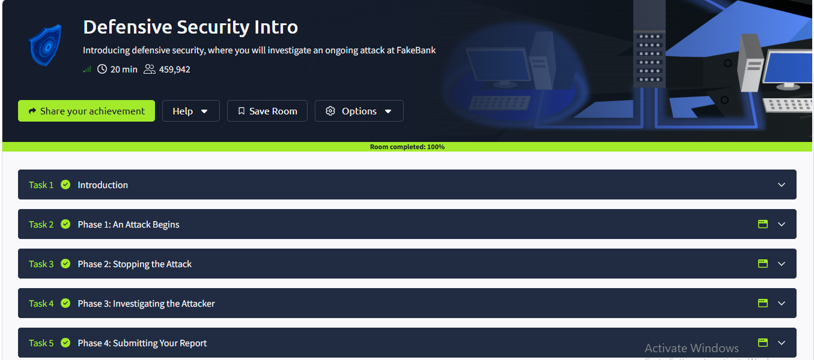

# Defensive Security Intro — TryHackMe

**Room:** [Defensive Security Intro](https://tryhackme.com/room/defensivesecurityintro)
**Date Completed:** 2026-09-19
**Difficulty:** Easy
**Time:** 20 minutes
**Status:** ✅ Completed (100%)

---

## 🎯 What I Learned

- **SOC (Security Operations Center)** — a team that monitors and defends a network 24/7
- **DFIR** — Digital Forensics and Incident Response
- **Threat Intelligence** — information about known attackers and their methods
- **SIEM** — Security Information and Event Management — the tool SOCs use to collect and analyze logs

## 📋 The Incident Workflow (FakeBank Attack)

The room walked through a real attack scenario step by step:

1. **Phase 1 — An attack begins** — Something unusual is detected on the network
2. **Phase 2 — Stopping the attack** — Incident responders contain the threat
3. **Phase 3 — Investigating the attacker** — Analysts trace the attacker's actions
4. **Phase 4 — Submitting your report** — A written report is delivered to stakeholders

## 🛠️ Skills Practiced

- SOC workflow
- Incident response phases
- Blue team mindset

## 🧠 Key Takeaway

The final report is the SOC analyst's most important deliverable. It tells leadership **what happened, how it was stopped, and how to prevent it next time**.

## 🔗 Screenshot

## ➡️ Next Room

[SOC Role in Blue Team](https://tryhackme.com/room/socroleinblueteam)
